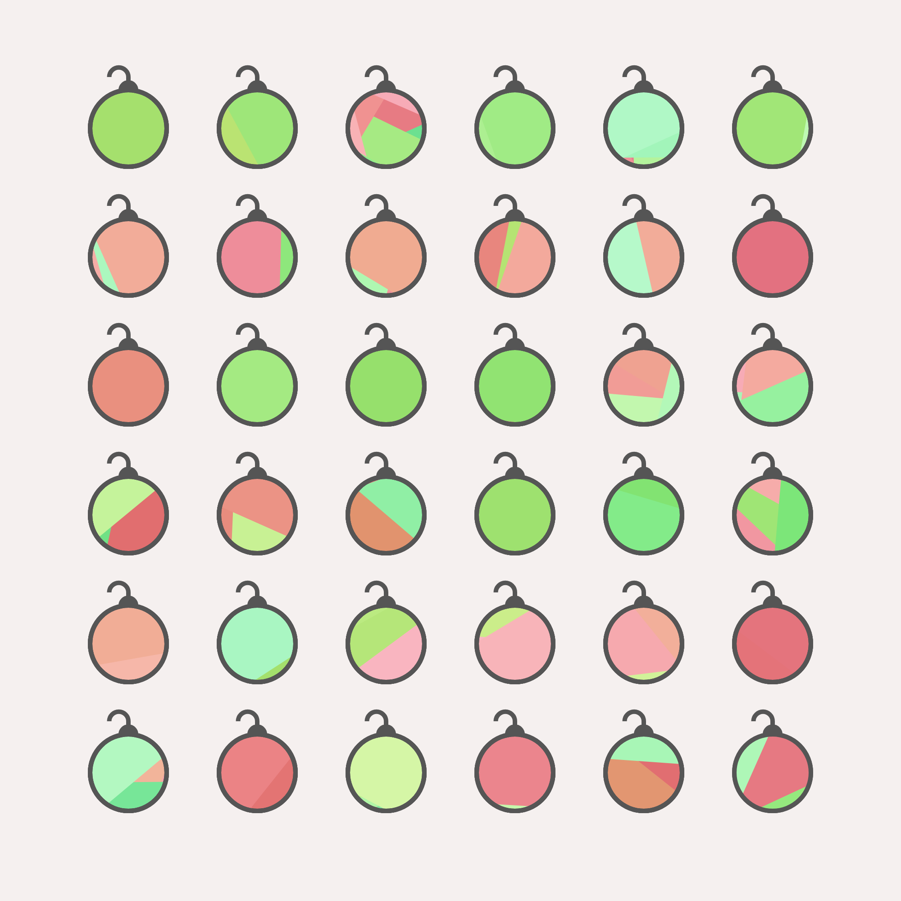

# Ornament Generation
This silly little thing makes images like this:  

# Credits
@mattdesl for `canvas-sketch` and `canvas-sketch-util`

[`canvas-sketch`](https://github.com/mattdesl/canvas-sketch)
[`canvas-sketch-util`](https://github.com/mattdesl/canvas-sketch-util)

# Usage
1. Download repo
2. `npm install`
3. `canvas-sketch sketch.js --open`

# Questions?
Lemme have'em! @TheMapSmith on Twitter or open an issue
